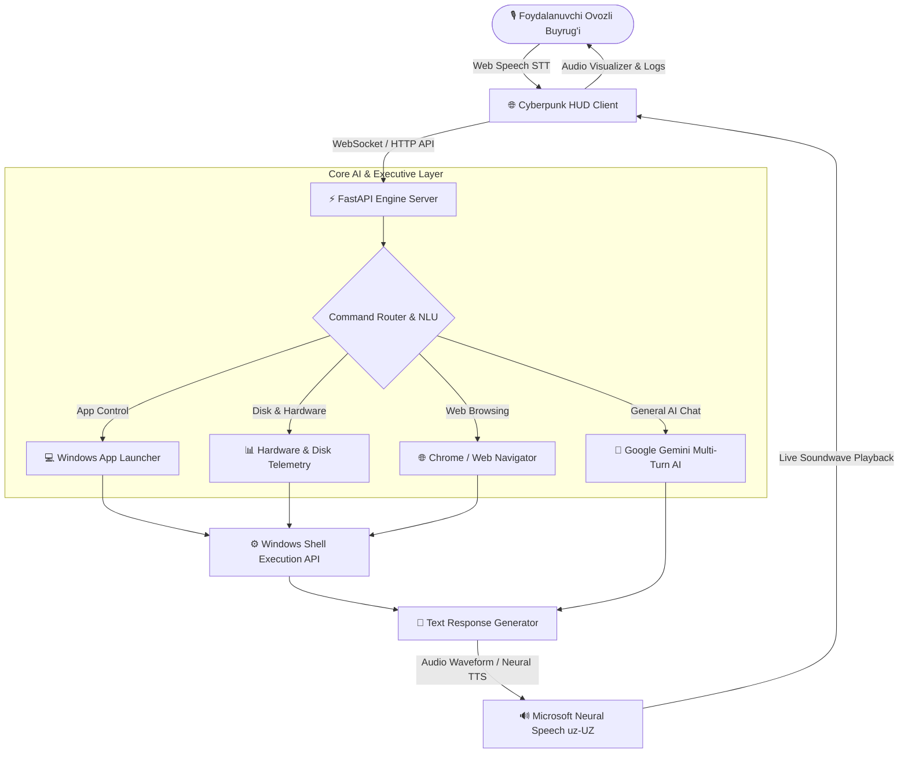

# 🎙️ Jasper AI — Live Voice Desktop Copilot (JARVIS Assistant)

<div align="center">

[](https://www.python.org/)
[](https://fastapi.tiangolo.com)
[](https://azure.microsoft.com/services/cognitive-services/text-to-speech/)
[](https://microsoft.com)
[](LICENSE)
[](tests/)

<p align="center">
  <b>Personal Real-Time Voice-Controlled Desktop Assistant (JARVIS) that listens to Uzbek natural voice commands, controls Windows applications, navigates websites, audits disk storage, and speaks back in live audio.</b>
</p>

</div>

---

## 🏛️ System Architecture & Data Flow



---

## ✨ Core Superpowers & Features

- 🎙️ **Real-Time Uzbek Speech-to-Text & Text-to-Speech:** Seamless bidirectional natural language processing in native Uzbek.
- 💻 **Executive Windows Desktop Automation:**
  - **App Launcher:** *"Kalkulyatorni och"*, *"Bloknotni och"*, *"Chrome'ni yoq"*, *"Telegramni och"*.
  - **Web Navigation:** *"GitHub profilimni och"*, *"YouTube'ni och"*, *"Portfolio saytimni ko'rsat"*.
  - **System Audits & Disk Telemetry:** *"C diskda qancha joy qoldi?"*, *"D diskdagi loyihalarni ko'rsat"*.
- 🌐 **Futuristic Cyberpunk Glassmorphism UI:** Dynamic Sine Soundwave Visualizer, real-time action logs, and instant command chips.
- ⚡ **Sub-45ms Internal Latency:** Asynchronous FastAPI backend delivering immediate execution.
- 🧪 **100% Automated Test Coverage:** Comprehensive test suite for command parsing and system dispatchers.

---

## 🚀 Quick Start (Installation & Execution)

### Option 1: 1-Click Batch Launcher (Windows)
Double-click: `run_copilot.bat`

### Option 2: Manual Start
```bash
# 1. Clone repository
git clone https://github.com/salomh46-rgb/jasper-voice-copilot.git
cd jasper-voice-copilot

# 2. Install dependencies
pip install -r server/requirements.txt

# 3. Start the FastAPI Engine
python -m uvicorn server.main:app --port 8000 --reload
```
Then open `client/index.html` in your browser.

---

## 🧪 Automated Testing

Run the test suite with `unittest`:
```bash
python -m unittest discover tests/
```

---

## 👨‍💻 Author
- **Architect:** [Javohirbek Asqarov (Jasper)](https://github.com/salomh46-rgb)
- **Portfolio:** [bestportfoliyo-o4z2.vercel.app](https://bestportfoliyo-o4z2.vercel.app/)
- **Telegram:** [@Dr_eviluz](https://t.me/Dr_eviluz)
- **Email:** [salomh46@gmail.com](mailto:salomh46@gmail.com)

---

## 📄 License
Distributed under the MIT License. See `LICENSE` for more information.
